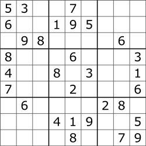

# SudokuBacktracking
We have both the option to run with or without an animated UI. Have in mind that the solution is a lot faster without it.

In all the cases, we use an abstract class called Game that has all operations and comprovations needed to solve the different types of sudoku using backtracking techniques.

---
## Normal cases

Because of the way we implemented, both the 9 by 9 and 16 by 16 are treated as the same in order to solve it, 
by just adding more or less conditions in each case to find the correct number in each cell.

### Sudoku 9 by 9

----
### Sudoku 16 by 16

## Special case

### Samurai

On the other hand, because this sudoku has different structure, we had to create a special class to solve it. 

This class called, Samurai, divides the board in 5 different sudokus of 9by9, and tries to solve the four external 
sudokus first. Once it solves all four of them, it looks for a solution that may contain the four corners found before.

